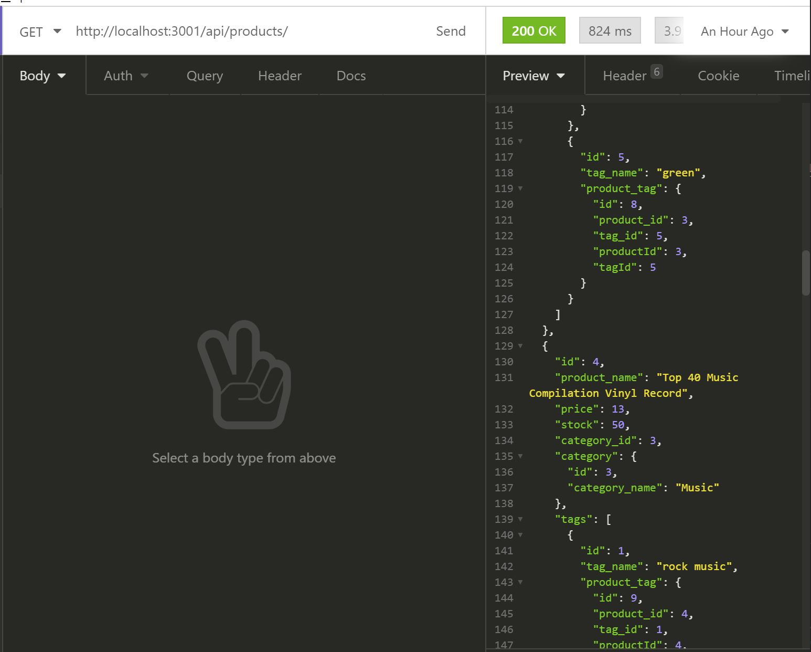
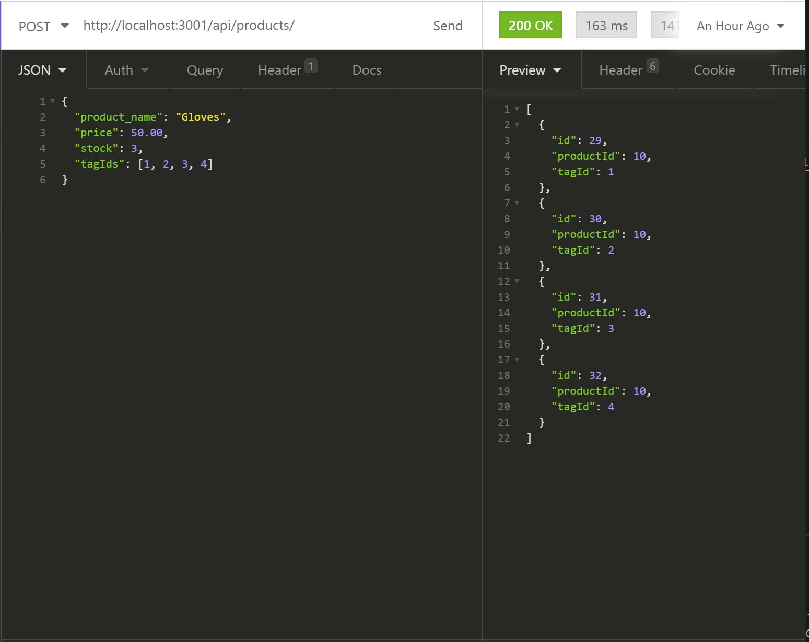
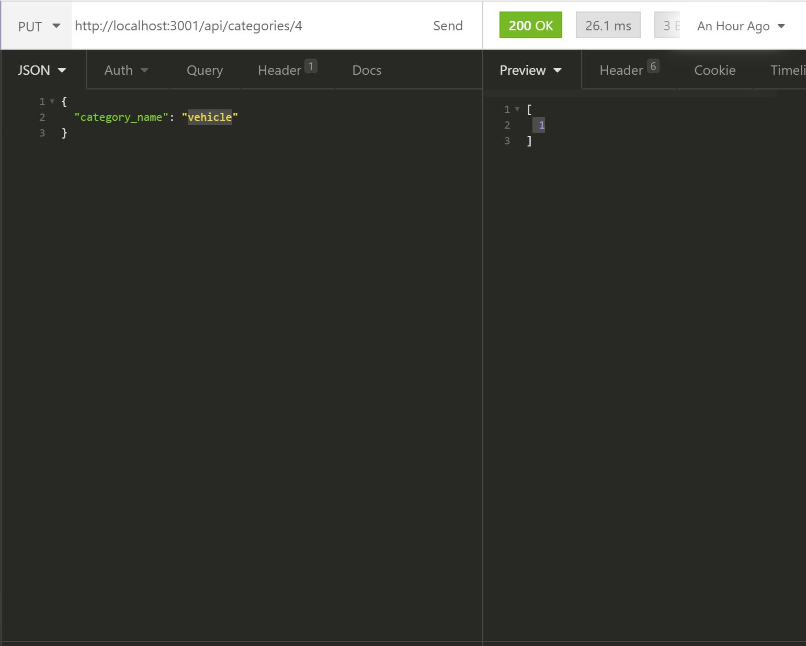

# e-commerce

     
  ## Description
  It is an application that allows a user to manage the backend of an e-commerce website. It makes use of sequelize to create Sql commands that are passed on to the server to access, edit, and delete data.

  ## Table of Contents
  * [Installation](#installation)
  * [Usage](#usage)
  * [License](#license)
  * [Contribution](#contribution)
  * [Test](#test)
  * [Questions](#questions)

  ## Installation
  1. Fork this repository to a local repository
  2. Install dependencies by running "npm install"
  3. Create Database and run the schema.sql file
  4. Run npm run seed to seed the tables in the database.
  5. Run npm start to start the server.

  ## Usage
  This Application should only be used for personal projects. You may not sell this or distribute this application

  ## License
  MIT

  ## Contributing
  You can contribute to this project by creating issues on this repository

  ## Test
  Follow the instructions ![here] (https://drive.google.com/file/d/1I0u1v-_W4wBL7iX_pjA0xUms3QM7z_y1/view) and ![here] (https://drive.google.com/file/d/1536NbvBwUM3_WcwWcNEqEDcAKV71zQN1/view) for testing procedures
                                      
  
  
  

  ## Questions
  You can create issues on my git hub page
  [hameed1239](https://github.com/hameed1239)
  You can also contact me via email @ hameeddecoder@gmail.com